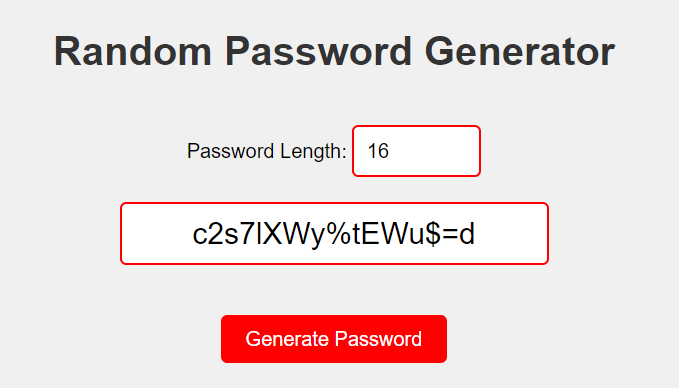

# Random Password Generator

This is a simple web application that generates random passwords.

## How to Use

1. Clone this repository to your local machine.
2. Open the `index.html` file in your web browser.
3. Enter the desired length of the password in the input field.
4. Click the "Generate Password" button to generate a random password.
5. Copy the generated password for your use.

## Technologies Used

- HTML
- CSS
- JavaScript

## Screenshots

## Credits

- Created by [Abhishek Kumar]

